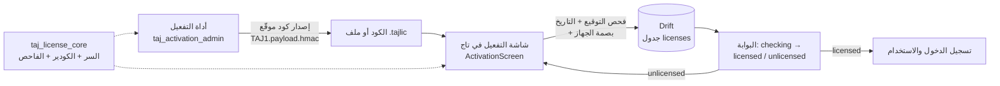

# تاج — Taj

نظام نقاط بيع (POS) و ERP عربي بالكامل يعمل **أوفلاين** لأسواق ليبيا (ملابس، عطور، هدايا)، مبني بـ Flutter. يجمع بين واجهة كاشير سريعة بوضعين (بسيط / محترف) ومزايا مستوحاة من برامج POS الليبية (مثل المحاسب 3)، مع **بوابة تفعيل ترخيص أوفلاين** تعمل قبل شاشة تسجيل الدخول.

[](https://github.com/md-tw26/taj/releases)
[](https://github.com/md-tw26/taj/releases)

> **حالة المشروع:** نسخة `1.2.0-beta.2+4` — تطبيق أوفلاين بالكامل (لا خادم)، تخزين محلي بـ Drift/SQLite، وتفعيل بترخيص موقّع HMAC‑SHA256 مربوط ببصمة الجهاز. خطط الباك اند والمزامنة موثقة في `TAJ-Backend-Plan.md` ولم تُنفَّذ بعد.

## ⬇️ التحميل — النسخة التجريبية `v1.2.0-beta.2`

| الأصل | المنصّة | الحجم | رابط مباشر |
|---|---|---|---|
| `taj-v1.2.0-beta.2-windows-setup.exe` | ويندوز x64 (مُثبِّت Inno Setup) | ‎13.0 MB‎ | [تحميل المُثبِّت](https://github.com/md-tw26/taj/releases/download/v1.2.0-beta.2/taj-v1.2.0-beta.2-windows-setup.exe) |
| `taj-v1.2.0-beta.2-android.apk` | أندرويد (APK) | ‎65.6 MB‎ | [تحميل التطبيق](https://github.com/md-tw26/taj/releases/download/v1.2.0-beta.2/taj-v1.2.0-beta.2-android.apk) |

كل الإصدارات: **[صفحة الإصدارات](https://github.com/md-tw26/taj/releases)**.

> **ملاحظة:** رابط `/releases/latest` يعرض الإصدار المستقر فقط — البيتا على وسم Pre-release.
> كما أن المُثبِّت **غير موقّع رقمياً**، فقد يعرض Windows SmartScreen تحذيراً («مزيد منعلومات» ← «تشغيل على أي حال»). ويتطلب صلاحية **مدير (admin)**.

## 1. ✨ المزايا

### بوابة التفعيل الأوفلاين (جديد)

- **بوابة تفعيل تُعرض قبل الدخول**: لا تصل التطبيق إلى شاشة تسجيل الدخول ما لم يكن تراخيص صالحًا.
- **تفصيل عن بعد**: الكود يُصدر من أداة المشغّل (`taj_activation_admin`) ويُلصق في التطبيق؛ لا يحتاج إنترنت ولا خادمًا.
- **ربط بالجهاز**: بصمة الجهاز تُحسب محلياً (`/etc/machine-id` أو بديل MAC+hostname) والترخيص لا يعمل على جهاز آخر.
- **إعادة فحص مع كل تشغيل**: الترخيص المحفوظ في Drift يُعاد التحقق منه عند كل إقلاع (انتهاء / تزوير / تغيّر جهاز → العودة لشاشة التفعيل).
- **قسم «الترخيص والتفعيل»** في الإعدادات (`SettingsSectionId.license`): حالة الترخيص، الباقة، تاريخ الانتهاء، بصمة الجهاز، وإلغاء التفعيل.

### واجهة الكاشير والمزايا التشغيلية

- **واجهة كاشير سريعة**: بحث + باركود، فئات جانبية قابلة للطي، شبكة/قائمة منتجات، بطاقات منتجات بمؤشرات دقيقة (لا شرائط ألوان).
- **وضعان للواجهة**:
  - **بسيط**: واجهة نقاط بيع أساسية بكل طرق الدفع.
  - **محترف**: كل المزايا المتقدمة (أدناه) + حفظ الاختيار تلقائيًا لكل مستخدم عبر `shared_preferences`.
- **زر «بيع نقداً» أخضر كبير بنقرة واحدة**: بيع فوري بدون رسالة تأكيد + اهتزاز + صوت بيع (يُتجاهل بهدوء على Linux عند غياب GStreamer).
- **طرق دفع ليبية**: نقدي، آجل، تحويل مصرفي، سداد، NUMO QR، MobiCash، تحويل إلى حساب، تحويل عبر سداد، تحويل عبر MobiCash، تقسيم الدفع.
- **الوضع المحترف**:
  - ملخص الجلسة (عدد المبيعات + نقد اليوم) أعلى الفاتورة.
  - **تقارير الجلسة**: KPI (إجمالي المبيعات / المعاملات / المنتجات)، نقد بالدرج، توزيع طرق الدفع، وإغلاق الوردية.
  - خصم % على الفاتورة، ملاحظة الطلب (تُطبع في الإيصال)، ربط عميل.
  - تعديل بند السلة (الكمية + السعر بصلاحية `changePrice`).
  - إيقاف/حفظ الطلب واسترجاعه بنقرة، مؤشرات المخزون المنخفض، إدارة الوردية (فتح/إغلاق).
- **الواجهات**: تسجيل دخول، كاشير POS، تاجر POS، لوحة تحكم، تقارير، مخزون، مشتريات، مصروفات، خزينة، محاسبة، موظفون، عملاء، منتجات، إعدادات، إشعارات، مساعد ذكي، تقارير ذكية.
- **تخزين محلي حقيقي**: قاعدة Drift/SQLite (`schemaVersion 2`) مع جداول المستودعات/الأصناف/المخزون/التراخيص… وترحيل مخطط من الإصدار 1 (يُنشئ جدول `licenses`).

## 2. 🔐 منظومة التفعيل الأوفلاين (جديد)

منظومة التفعيل **مكوّنة من ثلاثة مستودعات مربوطة ببعضها**: نفس الحزمة المشتركة، نفس السر، نفس بصمة الجهاز — ولهذا يتطابق التوقيع بين الأداة والتطبيق.

| # | المستودع | الدور | النوع |
|---|---|---|---|
| 1 | [`md-tw26/taj`](https://github.com/md-tw26/taj) (هذا المستودع) | **بوابة التفعيل**: شاشة تفعيل قبل الدخول، بصمة الجهاز، فحص HMAC‑SHA256 + التاريخ + البصمة، حفظ الترخيص في Drift، إعادة فحص عند كل تشغيل، وقسم «الترخيص والتفعيل» في الإعدادات | عام (public) |
| 2 | [`md-tw26/taj_activation_admin`](https://github.com/md-tw26/taj_activation_admin) | **أداة المشغّل** لإصدار التراخيص: جداول Drift (`AdminUsers` / `Customers` / `Licenses`)، حساب افتراضي، توليد كود موقّع + تصدير ملف `.tajlic` | **خاص (PRIVATE)** |
| 3 | [`md-tw26/taj_license_core`](https://github.com/md-tw26/taj_license_core) | **الحزمة المشتركة**: ترميز HMAC‑SHA256، بصمة الجهاز، سياسة التحقق — **المصدر الوحيد للتوقيع ويُستخدم من التطبيقَين معاً** | **خاص (PRIVATE)** |

> الروابط الخاصة تتطلب صلاحية وصول لحسابك؛ بدونها تظهر صفحة «Repository not found».

### كيف تترابط الثلاثة

- **صيغة الكود**: `TAJ1.<base64url(payload json)>.<base64url(HMAC‑SHA256)>` — التوقيع يغطي النص الحرفي `TAJ1.<payload>` (مقارنة ثابتة الزمن).
- **بصمة الجهاز**: ثماني مجموعات سداسية على شكل `F373-4CAD-D8B1-9C4E-F8CA-EAB4-324A-D55C`، تُحوَّل من مصدر ثابت بالجهاز عبر SHA‑256.
- **ملف `.tajlic`**: ظرف JSON يحمل الكود الموقّع كما هو (`format: tajlic`, `version: 1`) لنقله من الأداة إلى التطبيق.
- **نفس السر في الحزمتين**: `taj_license_core` يعرّف السر مرة واحدة، والأداة والتطبيق يبنيان معه — فالتوقيع يتطابق.



### ⚠️ ملاحظة أمنية

سر الـ HMAC **مضمَّن عمداً** في الحزمتين لأن التحقق أوفلاين بلا خادم. التوقيع يمنع التزوير وإنشاء تراخيص بدون المفتاح، لكنه **لا يحمي من يملك ملف التطبيق نفسه** (يمكن استخراج السر منه) — هذا مقصد التصميم وهو موثّق صراحةً في `taj_license_core/lib/src/secret.dart`. الحماية المستهدفة: منع توزيع تراخيص مزوّرة، وليس منع مُلّك التطبيق من فكّ حمايته.

## 3. 🔑 بيانات الدخول

التطبيقات **مربوطة ببعضها لكنها منفصلة**: حسابات التطبيق لا تفتح الأداة، وحساب الأداة لا يفتح التطبيق.

| التطبيق | المستخدم | كلمة المرور | ملاحظة |
|---|---|---|---|
| **تاج (POS)** | `admin` / `merchant` / `cashier` | أي كلمة غير فارغة (تطوير) | الدور يُحدد من اسم المستخدم |
| **أداة التفعيل** (`taj_activation_admin`) | `admin` | `admin123` | تُزرَع في قاعدة بيانات الأداة عند أول تشغيل |

**صلاحيات تاج حسب المستخدم:**

| اسم المستخدم | الدور | الصلاحيات |
|---|---|---|
| `admin` | أدمن | كل الصلاحيات: تعديل الأسعار، الخصومات، الاسترداد، التقارير، إدارة المستخدمين |
| `merchant` | تاجر | نفس صلاحيات الأدمن (لاختبار سريع) |
| `cashier` | كاشير | مقيد: بدون تعديل أسعار / خصومات / استرداد / تقارير — يرى واجهة POS البسيطة |

- **أداة التفعيل**: قفل بعد **5 محاولات خاطئة** لمدة 15 دقيقة (`maxFailedLoginAttempts = 5`).
- **قبل الدخول إلى تاج**: يجب إشباع بوابة التفعيل أولًا — الكود يصدر من الأداة ثم يُلصق في شاشة التفعيل.

> **ملاحظة:** بيانات تاج تجريبية للتطوير وليست للإنتاج؛ حساب الأداة (`admin`/`admin123`) هو الحساب الافتراضي المزروع ويُنصح بتغييره بعد التنصيب.

## 4. 🚀 التشغيل والنقل

### الترتيب المطلوب لمجلدات الاستنساخ (مهم)

الحزم الثلاث **يجب أن تكون مجلدات siblings بنفس الأسماء بالضبط**، لأن `pubspec.yaml` يعتمد على المسار النسبي `path: ../taj_license_core`:

```bash
git clone https://github.com/md-tw26/taj
git clone https://github.com/md-tw26/taj_activation_admin   # يتطلب صلاحية (خاص)
git clone https://github.com/md-tw26/taj_license_core       # يتطلب صلاحية (خاص)

# يجب أن تصبح المجلدات siblings بنفس الأسماء:
# parent/
# ├── taj/
# ├── taj_activation_admin/
# └── taj_license_core/
```

### أوامر التشغيل

```bash
# 1) تاج (هذا المستودع)
cd taj
flutter pub get
flutter analyze
flutter test
flutter run                              # تشغيل محلي
flutter build web --release              # نسخة ويب
flutter build linux --release            # نسخة لينكس

# 2) أداة التفعيل
cd ../taj_activation_admin
flutter pub get
flutter analyze
flutter test
flutter build linux --debug

# 3) حزمة الترخيص المشتركة (اختياري للتطوير)
cd ../taj_license_core
dart pub get
dart test
```

> إن لم تُستنسخ `taj_license_core` بجانب `taj` سيفشل `flutter pub get` بخطأ `No file or directory found for ../taj_license_core`.

### نسخة ويب ثابتة (عرض/لقطات)

```bash
flutter build web --release --target lib/screenshot_main.dart
python3 -m http.server 8099 --directory build/web
# ثم افتح: http://localhost:8099/?screen=cashier&dark=1&cart=1&pro=1
```

معاملات الواجهة التجريبية: `screen=login|cashier|merchant|admin` · `dark=1` · `cart=1` · `pro=1` · `reports=1`.

## 5. 🧪 خطوات تجربة التفعيل (أوفلاين بالكامل)

تجربة كاملة بلا إنترنت:

1. شغّل **أداة التفعيل** وسجّل الدخول `admin` / `admin123`.
2. من **«الزبائن»** أضف عميلًا جديدًا.
3. شغّل **تاج** على جهاز لم يُفعَّل: تظهر شاشة التفعيل (قبل تسجيل الدخول) — انسخ **بصمة الجهاز** من البطاقة المخصصة.
4. عد للأداة → **«إصدار ترخيص»**: الصق بصمة الجهاز، اختر الباقة (`تاج لايت` / `تاج POS` / `تاج برو POS` / `تاج ERP كامل`) وتاريخ الانتهاء، ثم أصدر الترخيص.
5. انسخ الكود المولّد (`TAJ1.…`) أو احفظه ملف **`.tajlic`** من زر «حفظ .tajlic».
6. عد لتاج → الصق الكود (أو استورد ملف `.tajlic`) واضغط **«تفعيل النظام أوفلاين»**.
7. عند نجاح التحقق يُحفظ الترخيص في Drift ويفتح التطبيق مباشرة — **بدون أي اتصال بالإنترنت**.
8. لإثبات الوجهة المزدوجة: كود مرتبط بجهاز آخر يُرفض برسالة «بصمة الجهاز» مع ذكر البصمة المطلوبة وبصمة هذا الجهاز.

حالات الرفض التي تظهر للعميل: `malformed` · `unsupportedVersion` · `badSignature` · `fingerprintMismatch` · `notYetValid` · `expired`.

## 6. 📊 الاختبارات

| المستودع | الأمر | الحالات |
|---|---|---|
| `taj` | `flutter test` | **≈ 676+** حالة اختبار عبر 18 ملفًا (جزء منها يُولَّد ديناميكيًا عبر حلقات الأحجام/الاتجاهات في ملفات `*_responsive_test.dart`) |
| `taj_activation_admin` | `flutter test` | **28** حالة اختبار عبر 6 ملفات |
| `taj_license_core` | `dart test` | **38** حالة اختبار — كلها ناجحة |

- **اختبار الربط بين التطبيقين** (`test/cross_app_fixture_test.dart` في `taj` و`taj_activation_admin`): يُصدر ترخيصًا عبر **مسار الأداة الحقيقي** (Drift + `LicensesRepository.issue`) مرتبطًا ببصمة الجهاز، يصدّره `.tajlic`، ثم يثبت أن مدقّق `taj` يقبله على جهاز الإصدار ويرفضه على أي جهاز آخر بنفس نص رسالة خطأ البصمة. الظرف المنشور `test/fixtures/cross_app_license.tajlic` هو الناتج الحقيقي من الأداة.
- اختبارات البوابة (`license_gate_test.dart`): تجربة تركيب → تفعيل → دخول، وإعادة الفحص عند كل تشغيل، ورسائل كل حالة رفض.
- اختبارات الهجرة (`license_migration_test.dart`): ترحيل قاعدة `schemaVersion 1 → 2` وإنشاء جدول `licenses`.
- اختبارات الاستجابة: كل شاشة تُرسم عبر ~14 مقاسًا (من 320px حتى 4K) وباتجاهين RTL/LTR لضمان عدم وجود overflow.

## 7. 📁 بنية المشروع

```
lib/
├── main.dart                     # نقطة الدخول + بوابة الترخيص + توجيه الأدوار
├── screenshot_main.dart          # مدخل لقطات الويب للعرض
├── core/
│   ├── theme/                    # ألوان Taj + ثيمات فاتح/داكن (Almarai)
│   ├── format.dart               # تنسيق الأرقام والدينار العربي (arNum/arDinar)
│   ├── sale_sound.dart           # صوت البيع (مقاوم للفشل)
│   ├── responsive.dart           # نقاط الكسر (هاتف → 4K)
│   ├── user_role.dart            # الأدوار والصلاحيات
│   └── demo/                     # متجر تجريبي بالذاكرة
├── data/
│   ├── database_provider.dart    # توفير قاعدة البيانات للشجرة
│   ├── local/                    # Drift: app_database.dart (+ .g.dart) — schemaVersion 2
│   └── repositories/             # مستودعات (Branches…) فوق Drift
├── modules/
│   ├── activation/               # بوابة التفعيل (جديد)
│   │   ├── activation_screen.dart    # شاشة التفعيل + بطاقة البصمة
│   │   ├── license_service.dart      # تحميل/تفعيل/إعادة فحص الترخيص
│   │   └── license_scope.dart        # InheritedWidget لحالة البوابة
│   ├── auth/                     # شاشة تسجيل الدخول
│   ├── cashier_pos/              # واجهة الكاشير (POS) مقسّمة لمكوّنات
│   ├── merchant_pos/             # واجهة التاجر
│   ├── pos_management/           # إدارة نقاط البيع
│   ├── settings/                 # الإعدادات (تشمل قسم «الترخيص والتفعيل»)
│   ├── dashboard/ sales/ reports/ smart_reports/ assistant/ notifications/
│   ├── products/ inventory/ purchases/ expenses/ treasury/ accounting/
│   ├── employees/ customers/ users/ day_closing/
│   └── ...
├── shared/widgets/               # نظام Taj UI المشترك
└── core/demo/                    # بيانات العرض
```

## 8. 🛠️ آخر الإصلاحات والتعديلات

- **إصلاح RenderFlex overflow** في قسم الفاتورة: منطقة الإجماليات أصبحت محدودة الارتفاع وتتمرر داخليًا على النوافذ القصيرة بدلًا من سحق قائمة الأصناف (كان يفيض بـ 76px).
- **إصلاح انهيار الصوت على Linux**: `SaleSound` يلغي الصوت على Linux (غياب إضافات GStreamer) ويلتقط أخطاء تدفق `audioplayers` حتى لا تقتل التطبيق.
- **تكبير قسم الفاتورة**: نسبة العرض أصبحت منتجات 56% / فاتورة 44% (بدل 60/40).
- **ميزات جديدة**: تقرير الجلسة، ملخص الجلسة، خصم الفاتورة، ملاحظة الطلب، ربط عميل، تعديل سعر البند، حفظ الوضع الاحترافي.
- **الانتقال لتخزين محلي**: Drift/SQLite مع ترحيل مخطط (`schemaVersion 2`).
- **بوابة التفعيل الأوفلاين** وحزمة `taj_license_core` المشتركة (انظر القسم 2).

## 9. 📄 توثيق إضافي

- `LOGIN_CREDENTIALS.md` — تفاصيل حسابات الدخول والصلاحيات.
- `TAJ-Activation-Platform-Plan.md` — خطة منصّة التفعيل (مدفوعة/مجدولة) ومسار الخادم مستقبلًا.
- `TAJ-SaaS-Licensing-Plan.md` — خطة الترخيص والاشتراكات (SaaS).
- `TAJ-Backend-Plan.md` — خطة الباك اند والمزامنة (مراحل التخزين المحلي → الخادم).
- `TAJ-Development-Fix-Plan.md` — خطة التطوير ومراحل الإصلاح.
- `TAJ-Project-Analysis.md` — تحليل المشروع ونتائج الفحص.
- `taj-erp-skill.md` — مهارة مساعدة للتطوير داخل المشروع.
- `supabase_schema.sql` — مخطط قاعدة بيانات Supabase (مرجعي للمزامنة القادمة).
- توثيق منظومة التفعيل داخل المستودعات الخاصة: `taj_activation_admin/README.md` (طريقة الإصدار) و`taj_license_core/README.md` (مواصفة الكود وواجهة API).

## 10. 🧰 التقنيات

Flutter · Dart · **Almarai** (خط النظام الوحيد: عربي + لاتيني، أوزان 300/400/700/800) عبر حزمة `google_fonts` · Drift + SQLite (`drift`, `sqlite3_flutter_libs`) · `crypto` (HMAC‑SHA256) · `audioplayers` (صوت البيع) · `shared_preferences` · `file_selector` (تصدير `.tajlic`) · `intl` · `path_provider` · RTL عربي كامل.

## 11. 📦 إصدار نسخة تجريبية (Beta)

1. حدّث `version` في `pubspec.yaml` (مثل `1.2.0-beta.2+4` مع رقم بناء متصاعد) ثم `git commit`.
2. أنشئ وادفع الوديعة والوسم: `git tag v1.2.0-beta.2 && git push origin main && git push origin v1.2.0-beta.2`.
3. يبدأ سير العمل `release.yml` تلقائياً: بناء Android APK + Windows على GitHub Actions.
4. عند نجاح البناء تُنشر **Pre-release** على صفحة الإصدارات تحوي أصلين فقط: `taj-<tag>-android.apk` (تطبيق أندرويد) و`taj-<tag>-windows-setup.exe` (مُثبِّت ويندوز بـ Inno Setup يحلّ محلّ `taj-<tag>-windows-x64.zip` القديم). المُثبِّت يُبنى في CI من سيناريو `windows/installer.iss` عبر `ISCC /DAppVersion=<الوسم> /DSourceDir=<مجلد Release>`.
   - **تنبيه:** المُثبِّت **غير موقّع رقمياً**، لذا قد يتحذّر Windows SmartScreen عند تنزيله أو تشغيله — اضغط «مزيد من المعلومات» ثم «تشغيل على أي حال».
   - يتطلب المُثبِّت صلاحية **مدير (admin)** ويستهدف ويندوز **x64** فقط (ويندوز 10 فأحدث).
5. لتجربة خط الأنابيب بدون إصدار: شغّل `release.yml` يدوياً من تبويب Actions (يبني ويرفع المخرجات فقط بلا إصدار).
